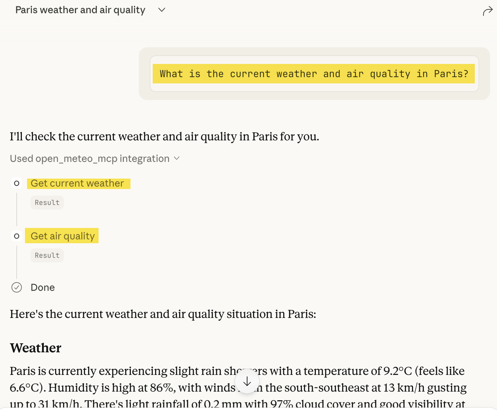

[](https://pypi.org/project/open-meteo-mcp/)
[](https://pypi.org/project/open-meteo-mcp/)

# Open Meteo MCP Server

mcp-name: io.github.isamauny/open_meteo_mcp

A Model Context Protocol (MCP) server that provides weather information using the Open-Meteo API. This server supports multiple transport modes: standard stdio, HTTP Server-Sent Events (SSE), and the new Streamable HTTP protocol for web-based integration.

## Table of Contents

- [Features](#features)
  - [Weather & Air Quality](#weather--air-quality)
  - [Time & Timezone](#time--timezone)
  - [Transport Modes](#transport-modes)
- [Installation](#installation)
  - [Standard Installation](#standard-installation)
  - [Manual Configuration for MCP Clients (Claude Desktop)](#manual-configuration-for-mcp-clients-claude-desktop)
  - [HTTP Server Installation (for web applications)](#http-server-installation-for-web-applications)
- [Server Modes](#server-modes)
  - [Mode Comparison](#mode-comparison)
  - [1. Standard MCP Mode (Default)](#1-standard-mcp-mode-default)
  - [2. HTTP SSE Mode (Web Applications)](#2-http-sse-mode-web-applications)
  - [3. Streamable HTTP Mode (Modern MCP Protocol)](#3-streamable-http-mode-modern-mcp-protocol)
- [Security & Authentication](#security--authentication)
  - [Un-secured Mode (Default)](#un-secured-mode-default)
  - [Secured Mode (WSO2 Identity Server/Asgardeo Authentication)](#secured-mode-wso2-identity-serverasgardeo-authentication)
  - [Authentication Feature Summary](#authentication-feature-summary)
- [Configuration](#configuration)
- [Usage](#usage)
  - [Available Tools](#available-tools)
  - [Tool Details](#tool-details)
- [MCP Client (Web Application)](#mcp-client-web-application)
  - [Features](#features-1)
  - [Architecture](#architecture)
  - [Installation](#installation-1)
  - [Configuration](#configuration-1)
  - [Running the Client](#running-the-client)
  - [Authentication Setup](#authentication-setup)
  - [Using the MCP Client Library](#using-the-mcp-client-library)
  - [MCP Client API Reference](#mcp-client-api-reference)
  - [Client Project Structure](#client-project-structure)
  - [Development](#development)
  - [Security Considerations](#security-considerations)
  - [Troubleshooting](#troubleshooting)
  - [Building Docker images from Source](#building-docker-images-from-source)
- [Development](#development-1)
  - [Project Structure](#project-structure)
  - [Running for Development](#running-for-development)
  - [Adding New Tools](#adding-new-tools)
- [Dependencies](#dependencies)
  - [Core Dependencies](#core-dependencies)
  - [SSE Server Dependencies](#sse-server-dependencies)
  - [Development Dependencies](#development-dependencies)
- [API Data Sources](#api-data-sources)
- [Troubleshooting](#troubleshooting-1)
  - [Common Issues](#common-issues)
  - [Error Responses](#error-responses)

## Features

### Weather & Air Quality
* Get current weather information with comprehensive metrics:
  * Temperature, humidity, dew point
  * Wind speed, direction, and gusts
  * Precipitation (rain/snow) and probability
  * Atmospheric pressure and cloud cover
  * UV index and visibility
  * "Feels like" temperature
* Get weather data for a date range with hourly details
* Get air quality information including:
  * PM2.5 and PM10 particulate matter
  * Ozone, nitrogen dioxide, carbon monoxide
  * Sulfur dioxide, ammonia, dust
  * Aerosol optical depth
  * Health advisories and recommendations

### Time & Timezone
* Get current date/time in any timezone
* Convert time between timezones
* Get timezone information

### Transport Modes
* Multiple transport modes:
  * **stdio** - Standard MCP for desktop clients (Claude Desktop, etc.)
  * **SSE** - Server-Sent Events for web applications
  * **streamable-http** - Modern MCP Streamable HTTP protocol with stateful/stateless options
* RESTful API endpoints via Starlette integration

## Installation

### Standard Installation

This package has been published here: https://pypi.org/project/open-meteo-mcp/ and can be installed locally using pip.

> [!TIP]
>
> We recommend to use Python [virtual environments](https://docs.python.org/3/library/venv.html) to separate installs.

```bash
pip install open_meteo_mcp
```

### Manual Configuration for MCP Clients (Claude Desktop)

This server is designed to be installed manually by adding its configuration to the `claude_desktop_config.json` file. 

> [!TIP]
>
> We recommend to install and use [uv](https://docs.astral.sh/uv/getting-started/installation/) (Python package manager)

1. Add the following entry to the `mcpServers` object in the config file - Make sure to use the **full path** to the uvx binary (use `which uvx`on Linux/Mac if you don't know where it was installed.)

```json
{
  "mcpServers": {
    "open_meteo_mcp": {
        "command": "<fullpath_to_uvx>",
            "args": [
                "open_meteo_mcp"
            ]
    },
    ...
  }
}
```

2. Save the `claude_desktop_config.json` file.
3. Restart Claude Desktop
4. Upon restart, test the MCP integration by asking questions such as: "*What is the current weather and air quality in Paris?*" 
 > [!NOTE]
 >
 > You will be asked to authorize the usage of the tools you just installed. 



### HTTP Server Installation (for web applications)

For HTTP SSE or Streamable HTTP support, you'll need additional dependencies:

```bash
pip install open_meteo_mcp starlette uvicorn
```

## Server Modes

This MCP server supports **stdio**, **SSE**, and **streamable-http** modes in a single unified server:

### Mode Comparison

| Feature | stdio | SSE | streamable-http |
|---------|-------|-----|-----------------|
| **Use Case** | Desktop MCP clients | Web applications (legacy) | Web applications (modern) |
| **Protocol** | Standard I/O streams | Server-Sent Events | MCP Streamable HTTP |
| **Session Management** | N/A | Stateful | Stateful or Stateless |
| **Endpoints** | N/A | `/sse`, `/messages/` | `/mcp` (single) |
| **Best For** | Claude Desktop, Cline | Browser-based apps | Modern web apps, APIs |
| **State Options** | N/A | Stateful only | Stateful or Stateless |

### 1. Standard MCP Mode (Default)
The standard mode communicates via stdio and is compatible with MCP clients like Claude Desktop.

```bash
# Default mode (stdio)
python -m open_meteo_mcp

# Explicitly specify stdio mode
python -m open_meteo_mcp.server --mode stdio
```

### 2. HTTP SSE Mode (Web Applications)
The SSE mode runs an HTTP server that provides MCP functionality via Server-Sent Events, making it accessible to web applications.

```bash
# Start SSE server on default host/port (0.0.0.0:8080)
python -m open_meteo_mcp --mode sse

# Specify custom host and port
python -m open_meteo_mcp --mode sse --host localhost --port 3000

# Enable debug mode
python -m open_meteo_mcp --mode sse --debug
```

**SSE Endpoints:**
- `GET /sse` - SSE endpoint for MCP communication
- `POST /messages/` - Message endpoint for sending MCP requests

### 3. Streamable HTTP Mode (Modern MCP Protocol)
The streamable-http mode implements the new MCP Streamable HTTP protocol with a single `/mcp` endpoint. This mode supports both stateful (default) and stateless operations.

```bash
# Start streamable HTTP server on default host/port (0.0.0.0:8080)
python -m open_meteo_mcp --mode streamable-http

# Specify custom host and port
python -m open_meteo_mcp --mode streamable-http --host localhost --port 3000

# Enable stateless mode (creates fresh transport per request, no session tracking)
python -m open_meteo_mcp --mode streamable-http --stateless

# Enable debug mode
python -m open_meteo_mcp --mode streamable-http --debug
```

**Streamable HTTP Features:**
- **Stateful mode (default)**: Maintains session state across requests using session IDs
- **Stateless mode**: Creates fresh transport per request with no session tracking
- **Single endpoint**: All MCP communication happens through `/mcp`
- **Modern protocol**: Implements the latest MCP Streamable HTTP specification

**Streamable HTTP Endpoint:**
- `POST /mcp` - Single endpoint for all MCP communication (initialize, tools/list, tools/call, etc.)

**Command Line Options:**
```
--mode {stdio,sse,streamable-http}  Server mode: stdio (default), sse, or streamable-http
--host HOST                          Host to bind to (HTTP modes only, default: 0.0.0.0)
--port PORT                          Port to listen on (HTTP modes only, default: 8080)
--stateless                          Run in stateless mode (streamable-http only)
--debug                              Enable debug mode
```

**Example SSE Usage:**
```javascript
// Connect to SSE endpoint
const eventSource = new EventSource('http://localhost:8080/sse');

// Send MCP tool request
fetch('http://localhost:8080/messages/', {
  method: 'POST',
  headers: { 'Content-Type': 'application/json' },
  body: JSON.stringify({
    type: 'tool_call',
    tool: 'get_weather',
    arguments: { city: 'Tokyo' }
  })
});
```

**Example Streamable HTTP Usage:**
```javascript
// Initialize session and call tool using Streamable HTTP protocol
async function callWeatherTool() {
  const response = await fetch('http://localhost:8080/mcp', {
    method: 'POST',
    headers: {
      'Content-Type': 'application/json'
    },
    body: JSON.stringify({
      jsonrpc: '2.0',
      method: 'tools/call',
      params: {
        name: 'get_current_weather',
        arguments: { city: 'Tokyo' }
      },
      id: 1
    })
  });

  const result = await response.json();
  console.log(result);
}
```

## Security & Authentication

### Un-secured Mode (Default)

By default, the MCP server runs **without authentication** - all endpoints are publicly accessible. This is suitable for:
- Local development and testing
- Desktop MCP clients (Claude Desktop, Cline) via stdio mode
- Internal network deployments
- Applications that handle authentication at a different layer

**Running in un-secured mode:**

```bash
# stdio mode (default - no authentication available)
python -m open_meteo_mcp

# SSE mode (no authentication)
python -m open_meteo_mcp --mode sse

# Streamable HTTP mode (no authentication)
python -m open_meteo_mcp --mode streamable-http
```

No additional configuration is required. The server will log: `"Authentication disabled - server is open"`

### Secured Mode (WSO2 Identity Server/Asgardeo Authentication)

For production deployments or when you need to secure your MCP server endpoints, you can enable **JWT token authentication** using WSO2 Identity Server.

> [!IMPORTANT]
>
> Authentication is only available in `streamable-http` mode.

#### Requirements

1. Install authentication dependencies:
   ```bash
   pip install open_meteo_mcp[auth]
   # or manually:
   pip install pyjwt cryptography
   ```

2. Set up WSO2 Identity Server/Asgardeo 
   Instructions are available in the [Asgardeo Setup guide](./weather-client/SECURITY_SETUP_TEST.md) in this repository.
3. Configure environment variables (see below)

#### Server Configuration

Enable authentication by setting the following environment variables:

**Required:**
- `AUTH_ENABLED=true` - Enables authentication
- `WSO2_IS_URL` - Your WSO2 IS base URL (e.g., `https://your-wso2-is.com` or `https://api.asgardeo.io/t/{orgName}`

**Optional** but highly recommended !

- `WSO2_IS_AUDIENCE` - Expected audience claim / client_id for token validation - This is the clientID of the MCP Client application created in IS.
- `WSO2_VERIFY_SSL` - Set to `false` to disable SSL verification (local dev only, default: `true`)

#### Running in Secured Mode

**Using environment variables:**

```bash
# Set environment variables
export AUTH_ENABLED=true
export WSO2_IS_URL="https://your-wso2-is.com"
export WSO2_IS_AUDIENCE="your-client-id"

# Start the server in streamable-http mode
python -m open_meteo_mcp --mode streamable-http --host 0.0.0.0 --port 8080
```

**For local development with self-signed certificates:**

```bash
export AUTH_ENABLED=true
export WSO2_IS_URL="https://localhost:9443"
export WSO2_VERIFY_SSL=false
export WSO2_IS_AUDIENCE="your-client-id"

python -m open_meteo_mcp --mode streamable-http --host 0.0.0.0 --port 8080
```

#### Making Authenticated Requests

When authentication is enabled, all requests to the `/mcp` endpoint must include a valid JWT Bearer token:

```javascript
// Get access token from your OAuth2 provider (e.g., client credentials flow)
const accessToken = "your-jwt-access-token";

// Make authenticated request
const response = await fetch('http://localhost:8080/mcp', {
  method: 'POST',
  headers: {
    'Content-Type': 'application/json',
    'Authorization': `Bearer ${accessToken}`
  },
  body: JSON.stringify({
    jsonrpc: '2.0',
    method: 'tools/call',
    params: {
      name: 'get_current_weather',
      arguments: { city: 'Tokyo' }
    },
    id: 1
  })
});
```

**Using curl:**

```bash
# Get access token (example using client credentials)
TOKEN=$(curl -X POST "https://your-wso2-is.com/oauth2/token" \
  -H "Content-Type: application/x-www-form-urlencoded" \
  -d "grant_type=client_credentials" \
  -d "client_id=YOUR_CLIENT_ID" \
  -d "client_secret=YOUR_CLIENT_SECRET" \
  | jq -r '.access_token')

# Make authenticated request
curl -X POST "http://localhost:8080/mcp" \
  -H "Content-Type: application/json" \
  -H "Authorization: Bearer $TOKEN" \
  -d '{
    "jsonrpc": "2.0",
    "method": "tools/call",
    "params": {
      "name": "get_current_weather",
      "arguments": {"city": "Tokyo"}
    },
    "id": 1
  }'
```

#### Authentication Response Codes

- **401 Unauthorized** - Missing, invalid, or expired token
  ```json
  {
    "error": "unauthorized",
    "message": "Missing Authorization header"
  }
  ```

- **200 OK** - Valid token, request processed successfully

#### Excluded Endpoints

The following endpoints are excluded from authentication (when configured):
- `/health` - Health check endpoint (if implemented)
- `OPTIONS` requests (CORS preflight)

### Authentication Feature Summary

| Mode | Authentication Support | Use Case |
|------|------------------------|----------|
| `stdio` | Not available | Desktop MCP clients (always un-secured) |
| `sse` | Not available | Web applications (always un-secured) |
| `streamable-http` | Optional (WSO2 IS) | Production web/API deployments |

## Configuration

This server does not require an API key for the weather data. It uses the Open-Meteo API, which is free and open-source.

## Usage

This server provides several tools for weather and time-related operations:

### Available Tools

#### Weather Tools
1. **`get_current_weather`** - Get current weather for a city with comprehensive metrics
2. **`get_weather_by_datetime_range`** - Get weather data for a date range with hourly details
3. **`get_weather_details`** - Get detailed weather information as structured JSON data

#### Air Quality Tools
4. **`get_air_quality`** - Get air quality information with pollutant levels and health advice
5. **`get_air_quality_details`** - Get detailed air quality data as structured JSON

#### Time & Timezone Tools
6. **`get_current_datetime`** - Get current time in any timezone
7. **`get_timezone_info`** - Get timezone information
8. **`convert_time`** - Convert time between timezones

### Tool Details

#### `get_current_weather`

Retrieves comprehensive current weather information for a given city with enhanced metrics.

**Parameters:**
- `city` (string, required): The name of the city (English names only)

**Returns:** Detailed weather data including:
- Temperature and "feels like" temperature
- Humidity, dew point
- Wind speed, direction (as compass direction), and gusts
- Precipitation details (rain/snow) and probability
- Atmospheric pressure and cloud cover
- UV index with warning levels
- Visibility

**Example Response:**
```
The weather in Tokyo is Mainly clear with a temperature of 22.5°C (feels like 21.0°C),
relative humidity at 65%, and dew point at 15.5°C. Wind is blowing from the NE at 12.5 km/h
with gusts up to 18.5 km/h. Atmospheric pressure is 1013.2 hPa with 25% cloud cover.
UV index is 5.5 (Moderate). Visibility is 10.0 km.
```

#### `get_weather_by_datetime_range`

Retrieves hourly weather information with comprehensive metrics for a specified city between start and end dates.

**Parameters:**
- `city` (string, required): The name of the city (English names only)
- `start_date` (string, required): Start date in format YYYY-MM-DD (ISO 8601)
- `end_date` (string, required): End date in format YYYY-MM-DD (ISO 8601)

**Returns:** Comprehensive weather analysis including:
- Hourly weather data with all enhanced metrics
- Temperature trends (highs, lows, averages)
- Precipitation patterns and probabilities
- Wind conditions assessment
- UV index trends
- Weather warnings and recommendations

**Example Response:**
```
[Analysis of weather trends over 2024-01-01 to 2024-01-07]
- Temperature ranges from 5°C to 15°C
- Precipitation expected on Jan 3rd and 5th (60% probability)
- Wind speeds averaging 15 km/h from SW direction
- UV index moderate (3-5) throughout the period
- Recommendation: Umbrella needed for midweek
```

#### `get_weather_details`

Get detailed weather information for a specified city as structured JSON data for programmatic use.

**Parameters:**
- `city` (string, required): The name of the city (English names only)

**Returns:** Raw JSON data with all weather metrics suitable for processing and analysis

#### `get_air_quality`

Get current air quality information for a specified city with pollutant levels and health advisories.

**Parameters:**
- `city` (string, required): The name of the city (English names only)
- `variables` (array, optional): Specific pollutants to retrieve. Options:
  - `pm10` - Particulate matter ≤10μm
  - `pm2_5` - Particulate matter ≤2.5μm
  - `carbon_monoxide` - CO levels
  - `nitrogen_dioxide` - NO2 levels
  - `ozone` - O3 levels
  - `sulphur_dioxide` - SO2 levels
  - `ammonia` - NH3 levels
  - `dust` - Dust particle levels
  - `aerosol_optical_depth` - Atmospheric turbidity

**Returns:** Comprehensive air quality report including:
- Current pollutant levels with units
- Air quality classification (Good/Moderate/Unhealthy/Hazardous)
- Health recommendations for general population
- Specific warnings for sensitive groups
- Comparison with WHO and EPA standards

**Example Response:**
```
Air quality in Beijing (lat: 39.90, lon: 116.41):
PM2.5: 45.3 μg/m³ (Unhealthy for Sensitive Groups)
PM10: 89.2 μg/m³ (Moderate)
Ozone (O3): 52.1 μg/m³
Nitrogen Dioxide (NO2): 38.5 μg/m³
Carbon Monoxide (CO): 420.0 μg/m³

Health Advice: Sensitive groups (children, elderly, people with respiratory conditions)
should limit outdoor activities.
```

#### `get_air_quality_details`

Get detailed air quality information as structured JSON data for programmatic analysis.

**Parameters:**
- `city` (string, required): The name of the city (English names only)
- `variables` (array, optional): Specific pollutants to retrieve (same options as `get_air_quality`)

**Returns:** Raw JSON data with complete air quality metrics and hourly data

#### `get_current_datetime`

Retrieves the current time in a specified timezone.

**Parameters:**
- `timezone_name` (string, required): IANA timezone name (e.g., 'America/New_York', 'Europe/London'). Use UTC if no timezone provided.

**Returns:** Current date and time in the specified timezone

**Example:**
```json
{
  "timezone": "America/New_York",
  "current_time": "2024-01-15T14:30:00-05:00",
  "utc_time": "2024-01-15T19:30:00Z"
}
```

#### `get_timezone_info`

Get information about a specific timezone.

**Parameters:**
- `timezone_name` (string, required): IANA timezone name

**Returns:** Timezone details including offset and DST information

#### `convert_time`

Convert time from one timezone to another.

**Parameters:**
- `time_str` (string, required): Time to convert (ISO format)
- `from_timezone` (string, required): Source timezone
- `to_timezone` (string, required): Target timezone

**Returns:** Converted time in target timezone

## MCP Client (Web Application)

The project includes a **React-based MCP Client** application that demonstrates how to integrate with the Open Meteo MCP Server using the MCP Streamable HTTP protocol. The client provides a user-friendly web interface for accessing weather and air quality data.

### Features

- **MCP Streamable HTTP Protocol**: Implements the MCP protocol for client-server communication
- **OAuth2/OIDC Authentication**: Supports secure authentication via WSO2 Identity Server or Asgardeo
- **Session Management**: Maintains stateful sessions with the MCP server
- **React Hooks**: Modern React hooks for data fetching and state management
- **TypeScript**: Fully typed client library for type-safe development
- **Responsive UI**: Built with Tailwind CSS for a modern, responsive design

### Architecture

The client application consists of:

- **MCP Client Library** ([mcpClient.ts](weather-client/src/services/mcpClient.ts)) - Core MCP protocol implementation
- **React Hooks** - Custom hooks for weather and air quality data
- **Authentication** - OAuth2/OIDC integration with WSO2 IS
- **UI Components** - Weather cards, air quality displays, search interface

### Installation

Navigate to the weather-client directory and install dependencies:

```bash
cd weather-client
npm install
```

### Configuration

Create a [.env](weather-client/.env) file in the `weather-client` directory with the following variables:

```bash
# MCP Server Configuration
VITE_MCP_SERVER_URL=http://localhost:8080

# OAuth2/OIDC Configuration (WSO2 IS or Asgardeo)
VITE_WSO2_IS_URL=https://your-wso2-is.com/oauth2
VITE_WSO2_CLIENT_ID=weather-client

# For Asgardeo (SaaS):
# VITE_WSO2_IS_URL=https://api.asgardeo.io/t/{your-org}/oauth2
```

**Configuration Options:**

| Variable | Description | Default |
|----------|-------------|---------|
| `VITE_MCP_SERVER_URL` | MCP server base URL | `http://localhost:8080` |
| `VITE_WSO2_IS_URL` | OAuth2 authority URL | `https://localhost:9443/oauth2` |
| `VITE_WSO2_CLIENT_ID` | OAuth2 client ID | `weather-client` |

### Running the Client

#### Development Mode

The client uses Vite for development with hot module replacement:

```bash
# Start the development server (default: http://localhost:5173)
npm run dev
```

**Important:** The Vite dev server proxies `/mcp` requests to the MCP server, so make sure your MCP server is running:

```bash
# In a separate terminal, start the MCP server
python -m open_meteo_mcp --mode streamable-http --host 0.0.0.0 --port 8080
```

#### Production Build

```bash
# Build for production
npm run build

# Preview the production build
npm run preview
```

### Authentication Setup

The client supports OAuth2/OIDC authentication via WSO2 Identity Server or Asgardeo.

#### WSO2 Identity Server Setup

1. **Create an Application** in WSO2 IS:
   
   - Application type: Single Page Application
   - Grant types: Authorization Code with PKCE
   - Callback URLs: `http://localhost:5173/callback` (dev), `https://your-domain.com/callback` (prod)
   - Allowed origins: `http://localhost:5173` (dev), `https://your-domain.com` (prod)
   
2. **Configure Scopes**:
   - Add `openid` (required)
   - Add `read_airquality` or other custom scopes as needed

3. **Update [.env](weather-client/.env)**:
   ```bash
   VITE_WSO2_IS_URL=https://your-wso2-is.com/oauth2
   VITE_WSO2_CLIENT_ID=your-client-id
   ```

#### Asgardeo Setup (Cloud)

[Asgardeo](https://asgardeo.io/) is WSO2's cloud identity platform:

1. **Register an Application** at [console.asgardeo.io](https://console.asgardeo.io)
2. **Configure OAuth2 settings**:
   - Authorized redirect URLs: `http://localhost:5173/callback`
   - Allowed origins: `http://localhost:5173`
   - Grant types: Code
3. **Update [.env](weather-client/.env)**:
   ```bash
   VITE_WSO2_IS_URL=https://api.asgardeo.io/t/{your-org}/oauth2
   VITE_WSO2_CLIENT_ID=your-client-id
   ```

### Using the MCP Client Library

The client library ([mcpClient.ts](weather-client/src/services/mcpClient.ts)) provides functions for calling MCP tools.

#### Basic Usage

```typescript
import {
  initializeSession,
  getCurrentWeather,
  getAirQuality,
  callMcpTool
} from './services/mcpClient';

// Initialize the MCP session (required before making tool calls)
await initializeSession(accessToken);

// Get current weather
const weather = await getCurrentWeather('Tokyo', accessToken);
console.log(weather);

// Get air quality with specific variables
const airQuality = await getAirQuality(
  'Beijing',
  ['pm2_5', 'pm10', 'ozone'],
  accessToken
);
console.log(airQuality);
```

#### Using React Hooks

The client includes custom React hooks for easy integration:

```typescript
import { useCurrentWeather } from './hooks/useWeather';
import { useAirQuality } from './hooks/useAirQuality';

function WeatherComponent() {
  const { data: weather, isLoading, error } = useCurrentWeather('Tokyo');
  const { data: airQuality } = useAirQuality('Tokyo');

  if (isLoading) return <div>Loading...</div>;
  if (error) return <div>Error: {error.message}</div>;

  return (
    <div>
      <h2>Weather in Tokyo</h2>
      <p>Temperature: {weather.current_weather.temperature}°C</p>
      <p>Humidity: {weather.current_weather.humidity}%</p>
    </div>
  );
}
```

### MCP Client API Reference

#### Session Management

**`initializeSession(accessToken?: string): Promise<void>`**

Initializes the MCP session with the server. Must be called before making tool calls.

- `accessToken` - Optional OAuth2 access token for authentication

#### Weather Functions

**`getCurrentWeather(city: string, accessToken?: string): Promise<string>`**

Get current weather for a city.

**`getWeatherDetails(city: string, includeForecast: boolean, accessToken?: string): Promise<string>`**

Get detailed weather data as JSON.

**`getWeatherByDateRange(city: string, startDate: string, endDate: string, accessToken?: string): Promise<string>`**

Get weather for a date range.

#### Air Quality Functions

**`getAirQuality(city: string, variables?: string[], accessToken?: string): Promise<string>`**

Get air quality information for a city.

- `variables` - Optional array of pollutants: `['pm2_5', 'pm10', 'ozone', 'nitrogen_dioxide', 'carbon_monoxide']`

**`getAirQualityDetails(city: string, variables?: string[], accessToken?: string): Promise<string>`**

Get detailed air quality data as JSON.

#### Time Functions

**`getCurrentDateTime(timezone: string, accessToken?: string): Promise<string>`**

Get current time in a specific timezone.

**`getTimezoneInfo(timezone: string, accessToken?: string): Promise<string>`**

Get timezone information.

**`convertTime(datetime: string, fromTimezone: string, toTimezone: string, accessToken?: string): Promise<string>`**

Convert time between timezones.

#### Generic Tool Call

**`callMcpTool(toolName: string, args: Record<string, unknown>, accessToken?: string): Promise<string>`**

Call any MCP tool by name with custom arguments.

```typescript
// Example: Call a custom tool
const result = await callMcpTool(
  'get_current_weather',
  { city: 'Paris' },
  accessToken
);
```

### Client Project Structure

```
weather-client/
├── src/
│   ├── components/          # React UI components
│   │   ├── WeatherDashboard.tsx
│   │   ├── WeatherCard.tsx
│   │   ├── AirQualityCard.tsx
│   │   ├── WeatherSearch.tsx
│   │   ├── LoginButton.tsx
│   │   └── ProtectedRoute.tsx
│   ├── hooks/              # React hooks
│   │   ├── useWeather.ts   # Weather data hooks
│   │   └── useAirQuality.ts # Air quality hooks
│   ├── services/           # Core services
│   │   └── mcpClient.ts    # MCP client implementation
│   ├── config/             # Configuration
│   │   └── auth.ts         # OAuth2/OIDC config
│   ├── types/              # TypeScript types
│   │   └── weather.ts      # Type definitions
│   ├── App.tsx             # Main app component
│   └── main.tsx            # Entry point
├── public/                 # Static assets
├── .env                    # Environment configuration
├── vite.config.ts          # Vite configuration
├── tailwind.config.js      # Tailwind CSS config
└── package.json            # Dependencies
```

### Development

#### Adding New MCP Tools

To add support for new MCP tools in the client:

1. Add the function to [mcpClient.ts](weather-client/src/services/mcpClient.ts):

```typescript
export async function getNewTool(
  arg1: string,
  accessToken?: string
): Promise<string> {
  return callMcpTool('tool_name', { arg1 }, accessToken);
}
```

2. Create a custom hook in `hooks/`:

```typescript
import { useQuery } from '@tanstack/react-query';
import { useAuth } from 'react-oidc-context';
import { getNewTool, initializeSession } from '../services/mcpClient';

export function useNewTool(arg1: string | null) {
  const auth = useAuth();
  const accessToken = auth.user?.access_token;

  return useQuery({
    queryKey: ['newTool', arg1],
    queryFn: async () => {
      if (!arg1) throw new Error('Argument required');
      await initializeSession(accessToken);
      return await getNewTool(arg1, accessToken);
    },
    enabled: !!arg1 && auth.isAuthenticated,
  });
}
```

3. Use the hook in your components:

```typescript
const { data, isLoading, error } = useNewTool('value');
```

#### Vite Proxy Configuration

The client uses Vite's proxy feature to forward `/mcp` requests to the MCP server during development. This is configured in [vite.config.ts](weather-client/vite.config.ts):

```typescript
export default defineConfig({
  server: {
    proxy: {
      '/mcp': {
        target: 'http://localhost:8080',
        changeOrigin: true,
      },
    },
  },
});
```

### Security Considerations

- **Token Storage**: Access tokens are stored in `sessionStorage` (cleared on tab close)
- **HTTPS**: Always use HTTPS in production for secure token transmission
- **CORS**: Configure CORS on the MCP server to allow requests from your client domain
- **Token Expiration**: The client includes token refresh logic (configure `automaticSilentRenew`)

### Troubleshooting

**CORS Errors**
- Ensure the MCP server includes CORS headers
- Check that your origin is allowed in the server configuration

**Authentication Fails**
- Verify OAuth2 configuration in [.env](weather-client/.env)
- Check redirect URIs match exactly (including trailing slashes)
- Ensure the MCP server is running with authentication enabled

**MCP Connection Errors**
- Verify the MCP server is running on the configured port
- Check that `VITE_MCP_SERVER_URL` points to the correct server
- Ensure the server is in `streamable-http` mode

**Session Issues**
- Session IDs are managed automatically via HTTP headers
- Clear sessionStorage if you encounter stale session errors

### Building Docker images from Source

If you want to build the Docker image yourself:

#### Standard Build
```bash
# Build
docker build -t mcp-weather-server:sse .

# Run (port will be read from PORT env var, defaults to 8081)
docker run -p 8081:8081 mcp-weather-server:sse

# Run with custom port
docker run -p 8080:8080 mcp-weather-server:local --mode sse
```

#### Streamable HTTP Build
```bash
# Build using streamable-http Dockerfile
docker build -f Dockerfile.streamable-http -t mcp-weather-server:streamable-http .

# Run in stateful mode
docker run -p 8080:8080 mcp-weather-server:streamable-http

# Run in stateless mode
docker run -p 8080:8080 -e STATELESS=true mcp-weather-server:streamable-http
```

## Development

### Project Structure

```
open_meteo_mcp/
├── src/
│   └── open_meteo_mcp/
│       ├── __init__.py
│       ├── __main__.py          # Main MCP server entry point
│       ├── server.py            # Unified server (stdio, SSE, streamable-http)
│       ├── utils.py             # Utility functions
│       └── tools/               # Tool implementations
│           ├── __init__.py
│           ├── toolhandler.py   # Base tool handler
│           ├── tools_weather.py # Weather-related tools
│           ├── tools_time.py    # Time-related tools
│           ├── tools_air_quality.py # Air quality tools
│           ├── weather_service.py   # Weather API service
│           └── air_quality_service.py # Air quality API service
├── tests/
├── Dockerfile                   # Docker configuration for SSE mode
├── Dockerfile.streamable-http   # Docker configuration for streamable-http mode
├── pyproject.toml
├── requirements.txt
└── README.md
```

### Running for Development

#### Standard MCP Mode (stdio)
```bash
# From project root
python -m open_meteo_mcp

# Or with PYTHONPATH
export PYTHONPATH="/path/to/mcp_weather_server/src"
python -m open_meteo_mcp
```

#### SSE Server Mode
```bash
# From project root
python -m open_meteo_mcp --mode sse --host 0.0.0.0 --port 8080

# With custom host/port
python -m open_meteo_mcp --mode sse --host localhost --port 3000
```

#### Streamable HTTP Mode
```bash
# Stateful mode (default)
python -m open_meteo_mcp --mode streamable-http --host 0.0.0.0 --port 8080

# With debug logging
python -m open_meteo_mcp --mode streamable-http --debug
```

### Adding New Tools

To add new weather or time-related tools:

1. Create a new tool handler in the appropriate file under `tools/`
2. Inherit from the `ToolHandler` base class
3. Implement the required methods (`get_name`, `get_description`, `call`)
4. Register the tool in `server.py`

## Dependencies

### Core Dependencies
- `mcp>=1.0.0` - Model Context Protocol implementation
- `httpx>=0.28.1` - HTTP client for API requests
- `python-dateutil>=2.8.2` - Date/time parsing utilities

### SSE Server Dependencies
- `starlette` - ASGI web framework
- `uvicorn` - ASGI server

### Development Dependencies
- `pytest` - Testing framework

## API Data Sources

This server uses free and open-source APIs:

### Weather Data: [Open-Meteo Weather API](https://open-meteo.com/)
- Free and open-source
- No API key required
- Provides accurate weather forecasts
- Supports global locations
- Historical and current weather data
- Comprehensive metrics (wind, precipitation, UV, visibility)

### Air Quality Data:
- Free and open-source
- No API key required
- Real-time air quality data
- Multiple pollutant measurements (PM2.5, PM10, O3, NO2, CO, SO2)
- Global coverage
- Health-based air quality indices

## Troubleshooting

### Common Issues

**1. City not found**
- Ensure city names are in English
- Try using the full city name or include country (e.g., "Paris, France")
- Check spelling of city names

**2. HTTP Server not accessible (SSE or Streamable HTTP)**
- Verify the server is running with the correct mode:
  - SSE: `python -m open_meteo_mcp --mode sse`
  - Streamable HTTP: `python -m open_meteo_mcp --mode streamable-http`
- Check firewall settings for the specified port
- Ensure all dependencies are installed: `pip install starlette uvicorn`
- Verify the correct endpoint:
  - SSE: `http://localhost:8080/sse` and `http://localhost:8080/messages/`
  - Streamable HTTP: `http://localhost:8080/mcp`

**3. MCP Client connection issues**
- Verify Python path in MCP client configuration
- Check that `open_meteo_mcp` package is installed
- Ensure Python environment has required dependencies

**4. Date format errors**
- Use ISO 8601 format for dates: YYYY-MM-DD
- Ensure start_date is before end_date
- Check that dates are not too far in the future

**5. Authentication errors (Secured Mode)**
- **401 Unauthorized - Missing Authorization header**
  - Ensure you're including the `Authorization: Bearer <token>` header in your requests
  - Verify the token is properly formatted (no extra spaces)

- **401 Unauthorized - Token validation failed**
  - Check that your JWT token is not expired
  - Verify the token was issued by the correct WSO2 IS instance (check `iss` claim)
  - Ensure the audience claim matches your `WSO2_IS_AUDIENCE` configuration
  - Verify the token signature is valid

- **Failed to import auth module**
  - Install authentication dependencies: `pip install open_meteo_mcp[auth]`
  - Or manually: `pip install pyjwt cryptography`

- **WSO2_IS_URL environment variable is required**
  - Set `WSO2_IS_URL` when `AUTH_ENABLED=true`
  - Example: `export WSO2_IS_URL="https://your-wso2-is.com"`

- **SSL certificate verification errors**
  - For production: Use valid SSL certificates
  - For local development only: Set `WSO2_VERIFY_SSL=false`
  - Never disable SSL verification in production

### Error Responses

The server returns structured error messages:

**Weather/API errors:**
```json
{
  "error": "Could not retrieve coordinates for InvalidCity."
}
```

**Authentication errors (Secured Mode):**
```json
{
  "error": "unauthorized",
  "message": "Missing Authorization header"
}
```
