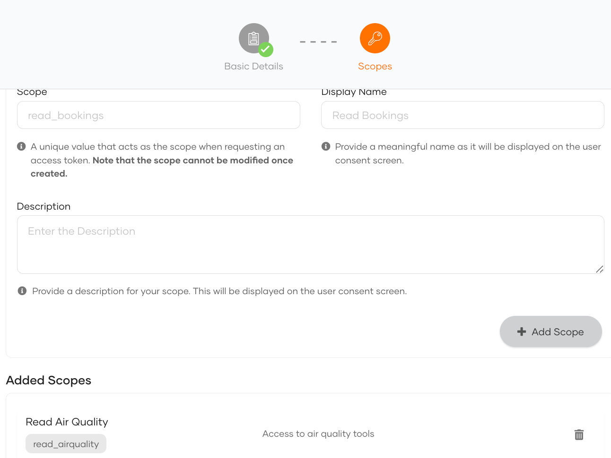
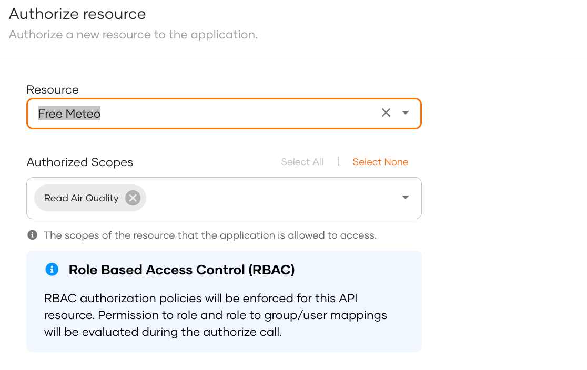
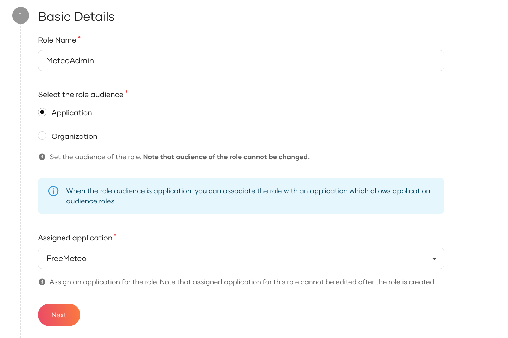
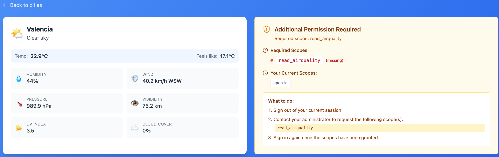
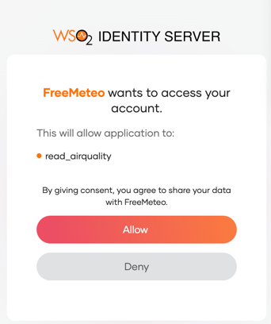

# Identity Server/Asgardeo Setup & Testing

This guide helps you configure WSO2's Identity Server authentication for the Weather MCP client and resolve issues.

## Table of Contents

- [Initial Setup](#initial-setup)
  - [Create MCP Server Resources](#create-mcp-server-resources)
  - [Create MCP Client Application](#create-mcp-client-application)
  - [Role and Users Creation](#role-and-users-creation)
- [Environment Variables](#environment-variables)
  - [How to Get Your Asgardeo Organization Name](#how-to-get-your-asgardeo-organization-name)
- [Configuration Checklist](#configuration-checklist)
- [Testing](#testing)
  - [1. Test Login Flow](#1-test-login-flow)
  - [2. Logout Flow](#2-logout-flow)
- [Troubleshooting](#troubleshooting)
  - [Clear Browser State](#clear-browser-state)
  - [Check Network Requests](#check-network-requests)
  - [Verify OIDC Endpoints](#verify-oidc-endpoints)
  - [Common Error Messages](#common-error-messages)

## Initial Setup

###  Create MCP Server Resources

1. Go to `Resources/MCP Servers`
2. Create an MCP Server
3. Set a unique ID as name (for example `mcp://free-meteo`)
4. Click **Next** to define scopes
5. Create a scope called `read_airquality` with *Read Air Quality* as display name plus a meaningful description
6. Click **Add Scope**

You should now see something similar to this:




### Create MCP Client Application

1. Go to [Asgardeo Console](https://console.asgardeo.io)
2. Sign in or create an account
3. Click **Applications** → **New Application**
4. Select **MCP Client Application**
5. Give it a name (e.g., "Weather Client")
6. Set the callback URL to : `http://localhost:5173/callback`

#### Configure Protocol Settings

In your application's **Protocol** tab:

##### Authorized Redirect URLs
Ensure the following URL is set:
```
http://localhost:5173/callback
```

##### Allowed Origins
Ensure the following URL is set:
```
http://localhost:5173
```

##### Grant Types
Ensure the following is checked:
- **Code** (Authorization Code with PKCE)
- Optionally check `Refresh Token`

##### Access Token Attributes

Under **Access Token**, make sure "roles" is selected 


#### Authorize Access to resources

1. Go to the Authorization tab
2. Click **Authorize resource**
3. Select the MCP server you just created as well as the scope. 

You should see something like this:



#### Note the Application Client ID

1. Go to the **Info** tab
2. Copy your **Client ID**
3. Save it - you'll need it for the `.env` file

### Role and Users Creation 

We need now to associate a role to the scope, and assign this role to a test user. 

#### Create a role

1. Go to Users/Roles and click **New Role**
2. Set *MeteoAdmin* as the role name 
3. Associate it to the Free Meteo MCP client application created earlier



#### Create test users

Create two test users: one without the MeteoAdmin role and one with the role. This allows you to test the application behavior when the *read_airquality* scope is present or not.

## Environment Variables

Create a `.env` file in the `weather-client` directory:

```bash
# Configuration for ASGARDEO
VITE_WSO2_IS_URL=https://api.asgardeo.io/t/your_org_name/oauth2/token
# Configuration for IS
# VITE_WSO2_IS_URL=https://<your_is_URL>/oauth2/token
VITE_WSO2_CLIENT_ID=your-mcp-client-id-here

# MCP Server
VITE_MCP_SERVER_URL=http://localhost:8080
```

### How to Get Your Asgardeo Organization Name

Your Asgardeo organization name is in your console URL:
```text
https://console.asgardeo.io/t/{yourorgname}/
                              ^^^^^^^^^^^^
                               This is your org name
```

## Configuration Checklist

Use this checklist to verify your setup:

- [ ] MCP Client Application created in console
- [ ] MCP Server resource created
- [ ] **Authorized redirect URLs** includes `http://localhost:5173/callback`
- [ ] **Allowed origins** includes `http://localhost:5173`
- [ ] **Grant Types** has "Code" enabled
- [ ] Roles added to Access Token
- [ ] MCP Client ID is copied to `.env` file
- [ ] Authority URL in `.env` ends with `/token`

## Testing

### 1. Test Login Flow

1. Start the dev server:
   ```bash
   npm run dev
   ```

2. Open http://localhost:5173 in a private window.

3. Click **Sign In**

4. You should be redirected to the IDP 

5. Login with the user that does <u>not</u> have the MeteoAdmin role. After successful login, you should be redirected back to the app.

6. The client application shows you the tools you do have access to:


7. Invoke the MCP for a city in the favorite list: you get the weather information but not the air quality information. 



7. Logout, clean up the storage as mentioned below 
8. Login with the user which does have the required role
9. You should see a consent window, authorizing access to the role/scope information
   

10. After allowing access, you should now see all tools as authorized and when choosing a city, see the full air quality information. 
    


### 2. Logout Flow

1. While logged in, click **Sign Out**

3. You should be redirected to the IDP logout page

4. After logout, you should be redirected back to http://localhost:5173

5. You should see the "Sign In" button again

   > [!TIP]
   >
   > if you're being authenticated again automatically, click **Sign Out** again and clear your browser state as per below.

## Troubleshooting

### Clear Browser State

If you're experiencing issues after log out, clear your browser state:

1. Open browser DevTools (F12)
2. Go to **Application** tab (Chrome) or **Storage** tab (Firefox)
3. Under ** Storage**, find `localhost:5173`
4. Right-click and **Clear**
5. Also clear **Local Storage**
6. Refresh the page

### Check Network Requests

1. Open DevTools → **Network** tab
2. Filter by "logout" or "end_session"
3. Look for the logout request
4. Check the response:
   - **200 OK** = Success
   - **400 Bad Request** = Check redirect URI configuration
   - **404 Not Found** = Check authority URL

### Verify OIDC Endpoints

You can verify Asgardeo's OIDC configuration by visiting:
```cmd
https://api.asgardeo.io/t/{your_org}/oauth2/token/.well-known/openid-configuration
```

This should return a JSON with:
- `authorization_endpoint`
- `token_endpoint`
- `userinfo_endpoint`
- `end_session_endpoint` ← Critical for logout

If `end_session_endpoint` is missing or incorrect, your authority URL might be wrong.

### Common Error Messages

| Error | Cause | Solution |
|-------|-------|----------|
| `invalid_request` | Logout redirect URI not allowed | Add URI to "Allowed logout return URLs" |
| `redirect_uri_mismatch` | URI doesn't exactly match | Check for trailing slashes, http vs https |
| `No end_session_endpoint` | Wrong authority URL | Add `/token` to authority URL |
| `Token expired` | ID token expired before logout | Code now handles this automatically |
| `CORS error` | Origin not allowed | Add origin to "Allowed origins" |
